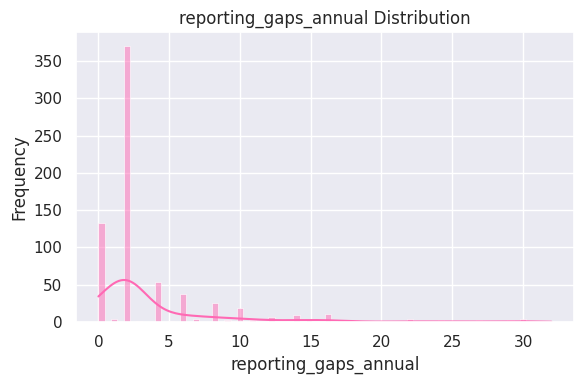

LUISS GUIDO CARLI
Undergraduate course of Management and Artificial Intelligence - 2nd Year
Machine Learning - Academic Year 2025/2026

# Compliance Radar

**Team Members**

Gentile Carmen Anna Pia      ID 311951

Bertelli Lavinia             ID 311111

Nasciuti Alice               ID 318631

Zorzoli Linda Carla          ID 314171

# 1. Introduction

Compliance Radar is a data-driven project developed for the “Compliance Radar” task. In the context of a research initiative on corporate integrity and operational risk, we were asked to analyze organizational data to uncover patterns that may indicate compliance challenges or ethical inconsistencies across departments. The motivation is that compliance risk in real organizations is rarely explained by a single variable: it typically emerges from a combination of operational pressure, governance and reporting practices, audit performance, and other organizational signals.

The objective of our work is therefore not only to describe departments, but to build an analytical framework that helps identify meaningful compliance profiles and supports evidence-based decision-making. We aim to surface groups of departments that share similar risk-related characteristics, highlight the factors that best explain these differences, and translate the findings into practical insights for risk mitigation.

To go beyond a simple clustering exercise, we adopt a multi-step approach. We begin with exploratory data analysis (EDA) to understand the dataset structure and quality, including missing values, distributions, and relationships between variables. We then use unsupervised learning to segment departments into interpretable clusters, capturing recurring patterns and potential “risk typologies”. In parallel to the clustering analysis, we also train a supervised classification model that could be used in the future to flag new or unseen departments that may be at higher risk, supporting early screening and prioritization.

Finally, we interpret the results from both clustering and classification to produce actionable conclusions and recommendations. The expected outcome is not just predictive performance, but a set of useful and replicable insights supported by a clear methodology—one that can be reused and extended to strengthen internal accountability processes

# 2. Methods

## 2.1 Data source & unit of analysis
Source of the project:
-`SQLite` database *`org_compliance_data.db`* 

We first explored the database structure (all the available tables and fields) and then extracted the relevant data.

From the database, we mainly use data from the department level, where each row represents a departments with variables describing:

- operational indicators
- reporting behavior
- risk exposure
- audit-related information
- engagement proxies

The resulting department-level table used throughout the analysis contains 709 rows and 37 columns.

## 2.2 Data extraction and working table

After loading the department-level data we created a single working table ( `df_dept`) that we used consistently across the EDA. 
Then we organized the available variables into coherent groups (numeric and categorical features), given that preprocessing and modelling steps differ by datatype. With these set of variables we structure the exploratory analysis and data quality checks. During data checks, we found no fully duplicated rows; however, a small number of dept_id values appear in multiple records with different attributes, suggesting that the identifier is not strictly unique in the raw data. We therefore retained *`dept_id`* and *`dept_name`* only for traceability and result interpretation (e.g., mapping clusters or predicted risk flags back to departments), while explicitly excluding them from the feature matrices used for clustering and classification, since they are high-cardinality identifiers and do not represent generalizable compliance signals
 

## 2.3 Feature inventory and design choices

After have performed the exploratory analysis of the full working table (df_dept), we selected a **smaller and interpretable set of variables** in order to use the best configuration for segmentation and prediction and reduce noise. These design choices then informed the preprocessing pipeline described in Section 2.4
Because our project includes both **segmentation** and **screening**, we defined two modelling configurations.

 **Clustering** 
We select a more compact feature subset, focused on behavioural and risk signals suitable for distance-based methods.

 **Classification**
We use a subset of feature purpose built for a future screening use case, while still preventing leakage.

**Leakage and Redundancy**
To prevent leakage and redundancy we used the correlation heatmap to inspect relationships among key variables, and we observed that `audit_score_q1` and `audit_score_q2` are strongly aligned between them and with `compliance_score_final`.

| feature_1       | feature_2               | corr     |
|----------------|--------------------------|----------|
| audit_score_q2 | compliance_score_final   | 0.861647 |
| audit_score_q1 | audit_score_q2           | 0.841087 |

To avoid creating clusters that "already know the answer",we decide to exclude both audit scores and compliance_score_final from the clustering feature set, and use compliance_score_final later in the project only for external interpretation and for constructing the supervised risk label.
We also decided to remove highly imbalanced  binary indicators from the clustering inputs and kept them only for post-hoc interpretation. Finally, we excluded high-cardinality categorical fields so that there would not be sparse one-hot encodings, focusing more on a small set of actionable categorical descriptors.

## 2.4 Preprocessing pipeline (missing values, outliers, encoding, scaling)

Before fitting any model we prepared the data in order to make them suitable for both clustering and classification. 

**Missing Values**

We first check the number of missing value and although several variables show a relatively high missingness rate almost around 40%, we decided not to drop these columns because missing values are spread across many features rather than being concentrated in a single variable, so removing them would risk discarding useful information for the later compliance risk assessment.
Instead, we adopted an imputation strategy:

- *median* for numeric features
- *mode* for categorical features

**Outliers**

Regarding outliers and highly skewed variables, we deliberately chose to not remove them because in a compliance setting extreme case can be very informative, as in the case 'training_hours_quarterly' (as shown in the figure below): they may indicate problematic departments and it is important that we detect them. For this reason, we did not apply outlier filtering, we just  control the impact of different numeric scales by standardizing numeric features as we have already explained.  

  
**Encoding and Scaling**

Since clustering algorithms work with numbers and compute similarity based on distances, for the *clustering part* we converted only the selected categorical variables into numeric format using One-Hot Encoding, this procedure allows to create a separate 0/1 column for each category.
We standardized only the numeric features with StandardScaler so that variables with larger scale do not dominate distance-based clustering, the cat are already on a comparable scale. One-hot encoded categorical variables were left unscaled since they are already on a 0/1 scale. We then combined the scaled numeric block and the encoded categorical block into a single input matrix (X_ready), which was used consistently to train and compare K-Means, Agglomerative Clustering, and DBSCAN

For the *classification module*, we implemented preprocessing within a scikit-learn Pipeline/ColumnTransformer (median + scaling for numeric, most-frequent + one-hot for categorical). This design ensures that imputers, encoders, and scalers are fitted only on the training folds during cross-validation, preventing leakage and making the training and evaluation procedure fully reproducible.

## 2.5 Unsupervised segmentation (Clustering)

To identify **recurring compliance profiles** without relying on predefined labels, we performed unsupervised segmentation and compared three clustering families on the same preprocessed input matrix (X_ready). We decide to use the same input matrix in order to allow a fair comparison of the three different method that we are going to use and ensure that the difference in the result are only due to the different algorithms rather than to different preprocessing choices

We implemented a consistent clustering pipeline (same inputs, encoding, and scaling) and tested three different clustering families:

1) **K-Means** suitable for compact clusters

2) **Agglomerative Clustering** as hierarchical alternative and because often yields stable, interpretable partitions

3) **DBSCAN** a density-based method that can explicitly label atypical observations as noise/outliers, which is particularly relevant in compliance contexts where rare extreme departments may warrant special attention 

For each method, we assigned a cluster label to every department (or a noise label for DBSCAN) and then linked these labels back to the original department table to support interpretation. We performed **cluster profiling** by summarizing the key numeric and categorical features within each cluster and comparing patterns across clusters, with the goal of translating purely geometric groups into compliance-relevant “risk typologies”.

### 2.5.1 Cluster tendency (PCA-based visualization)

Before interpreting the segmentation results, we used **PCA** on `X_ready` as a diagnostic step to visualize the data structure in two dimensions and assess whether the feature space suggests separable patterns. The first two principal components explain approximately **44.69%** of the variance, providing a compact view of the main structure while supporting qualitative inspection of potential cluster tendencies.

## 2.6 Supervised risk flagging (Classification)

To go beyond segmentation and support future monitoring, we add a supervised task: predicting whether a department should be considered **“high risk"**, to be able to catch in time departments that may require more attention.

First of all, we define the binary target `y_high_risk` by labeling as *high risk* the departments whose compliance_score_final falls at or below the 25th percentile of the compliance score distribution. Since this step of the task requires `compliance_score_final`, observations with missing values for this variable were removed at this stage.

To ensure reproducibility and a reliable final evaluation, we apply a stratified three-way split with fixed randomness (`random_state=42`): 60% training, 20% validation, and 20% test. To prevent leakage, `compliance_score_final` is used only to build `y_high_risk` and is then excluded from the feature matrix together with identifier fields (`dept_id`, `dept_name`).

We implement preprocessing via a scikit-learn `Pipeline`/`ColumnTransformer` (numeric: median imputation + scaling; categorical: most-frequent imputation + one-hot encoding), ensuring that all transformations are learned only from the training data and applied consistently during validation and testing. Multiple classification models are then trained under the same preprocessing pipeline, and the best-performing configuration is selected through cross-validated tuning before reporting final performance on the held-out test set.

# 3. Experimental Design

To evaluate the effectiveness of our approach, we organized the experimental validation into two blocks—one for the unsupervised module and one for the supervised module—each with clearly defined baselines and evaluation metrics aligned with the task objectives.

## Experiment 1 — Unsupervised segmentation: comparing clustering methods

**Purpose** 

We test whether departments can be segmented into coherent and interpretable compliance/risk profiles using the available department-level features, and we compare different clustering methods (K-Means, Agglomerative/Ward, and DBSCAN) to identify the most suitable one for this setting.

**Baselines**
 
We compare three unsupervised clustering approaches:

- **K-Means** 
- **Agglomerative Clustering (Ward linkage)**
- **DBSCAN** 

**Evaluation metrics**

We evaluate clustering quality through **internal validation**, to measures how well-defined the clusters are in the feature space. 
We use the **Silhouette score** to quantify whether departments are, on average, closer to their own cluster than to other clusters (higher values indicate clearer separation). In addition to the average silhouette, we report the **percentage of negative-silhouette assignments**, which identifies how many departments appear to be closer to a different cluster than their own, providing a practical indicator of unstable segmentations. We complement this with two widely used compactness/separation diagnostics: the **Davies–Bouldin index**, which increases when clusters overlap or are internally dispersed (lower is better), and the **Calinski–Harabasz score**, which increases when clusters are well separated relative to their internal variability (higher is better).
Because compliance segmentation must also be usable in practice, we include **coverage and usability checks** such as the number of clusters produced and the minimum/median cluster size, to avoid solutions dominated by very small or fragmented groups. For **DBSCAN**, we explicitly track the **fraction of points labeled as noise** (outliers). A high noise rate can be informative (rare, extreme departments), but if it becomes excessive it may indicate that the method is not producing a stable multi-cluster structure; for this reason, internal scores are computed only when at least two non-noise clusters exist (excluding noise points).

Finally, internal metrics alone do not guarantee compliance relevance. Therefore, we perform a **post-hoc external interpretation** by profiling clusters against `compliance_score_final` to verify whether the discovered groups correspond to meaningful differences in compliance outcomes and risk patterns.

**Design checks**

First, we assess cluster tendency through PCA-based visualization of the preprocessed feature space, to check whether departments show visible structure that could support meaningful segmentation. We then determine the appropriate number of clusters (**k**) for methods that require it (K-Means and Agglomerative) by combining quantitative evidence and practical constraints: we inspect how internal metrics evolve across candidate values of *k*, while also enforcing usability considerations such as avoiding solutions dominated by tiny clusters. In this phase, we explicitly monitor the **share of negative silhouette assignments**, since a high proportion typically indicates weak separation and unstable memberships even when average scores look acceptable.

For **DBSCAN**, where cluster formation depends on density parameters rather than a predefined *k*, we perform a **parameter sensitivity analysis** to examine the trade-off between the number of discovered clusters and the **fraction of departments labeled as noise**. This helps ensure that DBSCAN is not merely isolating a large portion of points as outliers and that the resulting structure remains interpretable. Finally, once a candidate clustering solution is selected, we focus on **interpretability and profiling**: we characterize each cluster by comparing feature distributions (or standardized means/medians) to derive qualitative “risk typologies” that can be communicated to stakeholders and used for targeted compliance actions.

**Experimental setup.**  
All clustering methods are compared on the same preprocessed feature matrix to ensure a fair evaluation. For K-Means and Agglomerative, scan candidate values of k supported by Silhouette diagnostics, and Elbow checks for K-Means, and select the final configuration by balancing internal metrics with interpretability. For DBSCAN, we explore plausible (`eps`, `min_samples`) settings and evaluate the trade-off between multi-cluster structure and noise rate.

## Experiment 2 — Supervised risk flagging 

**Purpose**  
We evaluate whether a predictive model can flag departments as **high risk** to support early screening and prioritization, emphasizing the reduction of false negatives (missed high-risk cases).
  
**Baselines**

We compare three supervised models under the same preprocessing pipeline:   

- **Logistic Regression** as an interpretable linear baseline,
- **SVM (RBF)** as a flexible non-linear classifier,
- **Random Forest** as a non-linear ensemble capable of capturing interactions and providing feature-importance signals.

**Evaluation metrics**  

Our classification objective is high-risk **screening**, where the cost of missing truly risky departments is high. For this reason, we prioritize **recall for the high-risk class**, which directly measures how many high-risk departments are correctly flagged (i.e., how few false negatives remain). To ensure that the screening is also operationally feasible, we also report **precision**, which quantifies how many flagged departments are truly high risk and therefore reflects potential workload for follow-up actions. We summarize the precision–recall trade-off with the **F1-score**, which balances the two when a single number is needed.

In addition to aggregate scores, we include the **confusion matrix** to provide a transparent breakdown of error types (false negatives vs false positives). This is particularly important in compliance settings, where stakeholders often need to understand *what kind* of mistakes a model makes, not just how accurate it is on average.

**Design checks**

As additional **design checks / supporting analyses** for the supervised stage, we follow a strict evaluation protocol to ensure that reported performance is not optimistic. In particular, **model selection and hyperparameter tuning** are carried out using the training data (and, where applicable, validation or cross-validation), while the **test set is kept completely untouched** until the very end and used only once for the final evaluation. This separation helps prevent information leakage from the test set into model decisions and provides a more reliable estimate of generalization performance.

Moreover, since compliance risk labels can be **imbalanced** (with fewer high-risk departments than low-risk ones), we adopt training strategies that account for skewed class distributions (e.g., **class weighting**, when applicable). For this reason, we prioritize **class-specific metrics**—especially precision, recall, and F1-score for the high-risk class—together with the confusion matrix, as they provide a more operationally meaningful view of errors than aggregate accuracy alone.
Finally, as a complementary diagnostic for the selected Logistic Regression model, we compute the **ROC curve and ROC-AUC on the held-out test set** using predicted probabilities. ROC-AUC provides a threshold-independent view of ranking performance and is computed only after model selection/tuning is completed; it is not used to guide training decisions.

**Experimental setup.**  
We define `y_high_risk` using the lower quartile of `compliance_score_final`, then apply a stratified three-way split with fixed randomness (`random_state=42`): **Train 60% / Validation 20% / Test 20%**. We tune Logistic Regression via **GridSearchCV (5-fold CV)** optimizing **recall** (`scoring="recall"`) over `n_estimators`, `max_depth`, `min_samples_split`, `min_samples_leaf`, and `class_weight` (including `"balanced"`). After selecting the best configuration, we report final performance on the held-out test set.

## 4. Results

### **Exploratory Patterns in Compliance Risk**

The results indicate that compliance risk is highly concentrated and structurally driven, rather than uniformly distributed across departments. This conclusion emerges consistently from the exploratory data analysis, which highlights substantial heterogeneity in the distribution of key compliance-related variables.

The variable `compliance_score_final` 

exhibits a wide range of values (as we can see from the barplot), with most departments concentrated at relatively high scores and a non-negligible tail showing markedly lower compliance performance. Similarly, `reporting_gaps_annual`

displays a strongly right-skewed distribution, indicating that while many departments exhibit limited process weaknesses, a small subset experiences pronounced structural gaps. Incident-related variables such as `violations_past_3years`

further reinforce this pattern, with a limited number of departments accounting for a disproportionate share of total incidents. Taken together, these distributions suggest that compliance risk is unevenly distributed and concentrated among structurally distinct departments, motivating the use of segmentation techniques to uncover underlying risk profiles.

### **Comparison of Clustering Approaches**

To assess the robustness and practical usefulness of the segmentation, K-Means clustering was compared with Agglomerative Clustering and DBSCAN using multiple internal validation metrics. The table below summarizes the main evaluation results.

| Model         | Params         |n_cl|noise_%| min_cl_size | median_cl_size |
|---------------|-------------------------|------------|---------|------------------|---------------------|
| KMeans        | k = 7                   | 7          | 0.00    | 27               | 82.0                |
| Aggl. | ward, k = 7             | 7          | 0.00    | 29               | 76.0                |
| DBSCAN        | eps = 1.4, min_samples = 10 | 3      | 45.42   | 27               | 106.0               |

| Model         | Silhouette | Negative Silhouette (%) | Davies–Bouldin | Calinski–Harabasz |
|---------------|------------|--------------------------|----------------|-------------------|
| KMeans        | 0.3822     | 24.12                    | 1.6225         | 121.59            |
| Agglomerative | 0.3570     | 30.75                    | 1.7539         | 102.73            |
| DBSCAN        | 0.6714     | 13.70                    | 1.4629         | 147.31            |

At a high level, all methods confirm the presence of heterogeneity in compliance risk. However, important differences emerge when considering cluster structure, stability, and interpretability. DBSCAN achieves high silhouette and Calinski–Harabasz scores, but at the cost of labeling a large share of departments as noise, significantly reducing its usefulness for organizational risk segmentation. Agglomerative Clustering produces balanced clusters without noise, but exhibits weaker separation and higher negative silhouette proportions compared to K-Means.

K-Means provides the most balanced trade-off between cluster separation, stability, and interpretability. It avoids excessive noise assignment, maintains reasonably balanced cluster sizes, and achieves stronger separation metrics than Agglomerative Clustering. For these reasons, and given the objective of defining clear and actionable compliance risk profiles, K-Means was selected as the primary clustering approach for the remainder of the analysis.

### **Cluster-Based Risk Segmentation**
Using k-means, departments cluster into distinct compliance risk profiles. Two clusters emerge as highest-priority, but with different signatures: an incident-heavy cluster with higher `violations_past_3years` and weaker overall outcomes and a reporting-driven cluster with higher `reporting_gaps_annual` and weaker audit signals in the ex post profiling that indicates different risk mechanisms. Medium-risk clusters show acceptable `compliance_score_final` in ex post validation with early signs of fragility, while low-risk clusters combine high `compliance_score_final` with minimal `reporting_gaps_annual` and low incident frequency.

### **Cluster Interpretation, Personas, and Key Insights**

K-Means clustering segmented 709 departments into three risk levels: 36% operate at low
risk (baseline), 53% at medium risk (process improvement needed), and 12% at high risk
(immediate intervention required). Risk levels are validated by external compliance scores
and enable proportionate resource allocation.

**Risk Level Distribution**

| Risk Level | Departments | Percentage |
|----------|------------|------------|
| LOW | 254 | 35.8% |
| MEDIUM | 373 | 52.6% |
| HIGH | 82 | 11.6% |

**LOW RISK: Baseline Compliance**

**254 departments (35.8%) | Cluster 2**

**Profile**

- Violations: ~0 (essentially zero)
- Reporting gaps: ~2 (lowest)
- Reporting lag: ~1 day (lowest)
- Operational health: Good (~4.0)
- Compliance score: ~65
- Organization: 100% `Operational_Compliance`, 100% Support, 100% Large teams, 100% `Corporate_HQ`

**Interpretation**

Clean baseline with near-zero violations and minimal reporting issues. Highly homogeneous
organizational structure represents the gold standard for compliance operations.

**Actions**

- Routine monitoring (standard frequency)
- Maintain current resources (15% of compliance budget)
- Use as benchmark and mentor for other segments

**MEDIUM RISK: Process Improvement Needed **

**373 departments (52.6%) | Clusters 0, 1, 3, 4, 6**

**Profile**
- Violations: Low to moderate
- Reporting gaps: Moderate to elevated
- Reporting lag: Moderate delays
- Operational health: Variable (2.0–4.6)
- Compliance score: ~65–72
- Organization: Predominantly `Financial_Reporting`, heterogeneous structure

**Interpretation**

Largest segment exhibiting process inefficiencies, operational challenges, or isolated red
flags. Internal variation spans from departments close to baseline (needing minor fixes) to
those approaching crisis threshold (requiring preventive intervention).

**Actions**

- Enhanced monitoring (weekly to monthly reviews)
- Moderate resources (45% of compliance budget)
- Process improvement initiatives, workflow optimization
- Operational assessments and targeted training
- Resource allocation review for struggling departments

**HIGH RISK: Immediate Intervention Required**

**82 departments (11.6%) | Cluster 5**

**Profile**

- Violations: Elevated
- Reporting gaps: Significant
- Reporting lag: Substantial delays
- Operational health: Below average to poor
- Compliance score: ~55 (lowest, 17% below medium)
- Variability: Highest (std ~23.7) indicating diverse failure modes
- Organization: Predominantly `Financial_Reporting`, heterogeneous structure

**Interpretation** 

Systemic compliance failures with multiple simultaneous breakdowns. High variability
suggests diverse root causes requiring individualized diagnosis. At 11.6%, this segment is
large enough to warrant dedicated resources but small enough for intensive individual
attention.

**Actions**

- Intensive monitoring (daily surveillance, real-time alerts)
- Priority resources (40% of compliance budget)
- Comprehensive assessments within 30 days
- Root cause analysis and individualized remediation plans
- Dedicated remediation teams and enhanced supervision
- Leadership accountability review
- Escalation if no improvement within 90 days

**Comparative Analysis**

| Metric | LOW | MEDIUM | HIGH |
|------|-----|--------|------|
| Compliance Score | ~65 | ~65–72 | ~55 |
| Violations | ~0 | Low–Moderate | Elevated |
| Reporting Issues | Minimal | Moderate | Significant |
| Operational Health | Good | Variable | Poor |
| Monitoring | Routine | Enhanced | Intensive |
| Resource Allocation | 15% | 45% | 40% |

**Key Distinction:** Low-to-Medium represents process maturity differences; Medium-to-High
represents a qualitative shift from manageable challenges to systemic failure requiring
crisis-level response.

**Strategic Recommendations**

**Phased Intervention**

- **Phase 1 (0–30 days):** Stabilize High-risk (comprehensive assessments, remediation
plans)
- **Phase 2 (30–90 days):** Implement High-risk remediation; process improvements for
Medium-risk
- **Phase 3 (90–180 days):** Monitor improvement; escalate non-performers; consolidate
gains

**Success Metrics**

- **Low:** Maintain zero violations, minimal reporting issues
- **Medium:** 50% migration to Low within 12 months
- **High:** 75% migration to Medium within 6 months, 100% show measurable improvement
within 90 days
- **Organization-wide:** Reduce High-risk to <5% within 12 months; increase Low-risk to >50% within 18 months

**PCA**
To further assess the robustness and interpretability of the clustering results, a Principal Component Analysis (PCA) projection was used to visualize departments in a lower-dimensional space. In particular,PCA underlines high-risk clusters that remain clearly distinguishable from low-risk clusters in the PCA space, providing additional evidence that the identified segmentation reflects genuine structural differences rather than artifacts of high-dimensional geometry.

The segmentation results provide several important insights into the structure of compliance risk within the organization.

- Compliance risk is **categorical**, not a smooth continuum.
- Departments form distinct regimes mixing **outcomes + structural signals**.
- A few clusters concentrate most **weaknesses and incidents**.

This empirical structure implies that segmentation meaningfully differentiates departments according to their compliance characteristics, rather than merely ranking them along a single score.

### **Predictive Drivers of Compliance Outcomes**
Predictive results highlight that operational and reporting variables are the strongest drivers of compliance outcomes. In particular, models that include `reporting_gaps_annual` and related indicators outperform approaches that rely mainly on `audit_score_q2` on the validation set. This suggests that `compliance_score_final` reflects ongoing operational behavior more than periodic audit controls, with audit scores capturing more surface-level assessments. The predictive outputs also align well with the clustering structure: departments flagged as high-risk are mostly concentrated in the high-risk clusters, while low-risk clusters are rarely flagged. Overall, prediction and clustering appear consistent and complementary, capturing the same underlying compliance risk patterns from different angles.
 
 
 
 
# Predictive Analysis: High-Risk Classification

## Executive Summary

Logistic Regression model successfully identifies high-risk departments (bottom 25%
compliance score) with 80% recall and 92% precision on test set. The model prioritizes
precision over recall, minimizing false alarms (only 2 false positives) while detecting 24 of 30
high-risk departments. Model serves as effective screening tool for prioritizing compliance
interventions.

## Target Variable & Data Split

**Target:** High risk = bottom 25% of `compliance_score_final` ( less or equal 55.0) | 433 departments total

| Class | Total | Train | Val/Test |
|-------|-------|-------|----------|
| Not High-Risk (0) | 285 (65.8%) | 259 | 87 each |
| **High-Risk (1)** | **148 (34.2%)** | ~88 | ~30 each |
**Features:** 34 total (25 numerical + 9 categorical). Audit scores, risk exposure, operational
metrics, reporting gaps, training hours.

*Critical: compliance_score_final excluded from features* (used only for target).

## Model Performance (Test Set)

**Model:** Logistic Regression (baseline model, retrained on Train+Val)

| Metric | High-Risk Class | Overall |
|--------|-----------------|---------|
| Recall | **0.800 (24/30 detected)** | - |
| Precision | **0.923 (24/26 correct flags)** | - |
| F1-Score | 0.857 | - |
| **Accuracy** | - | **0.908 (79/87)** |

**Confusion Matrix:** TN=55, FP=2, FN=6, TP=24 | 6 false negatives (missed high-risk) but
only 2 false positives (excellent precision)

## Feature Importance (Top 10 Coefficients)

Note: Logistic Regression uses coefficients instead of feature importances. Positive
coefficients increase probability of high-risk classification. 

| Rank | Feature | Type | Coefficient Direction |
|------|---------|------|-----------------------|
| **1** | **audit_score_q2** | Audit Performance | Negative (lower = higher risk) |
| **2** | **audit_score_q1** | Audit Performance | Negative (lower = higher risk) |
| 3 | overall_risk_score | Risk Exposure | Positive (higher = higher risk) |
| 4 | reporting_gaps_annual | Process Weakness | Positive (more gaps = higher risk) |
| 5 | training_hours_quarterly | Training | Negative (less training = higher risk) |
| 6-10 | risk_exposure_financial, reporting_lag_days, operational_health_index,
violations_past_3years | Mixed | Mixed directions |
**Key Insight:** Audit performance (q1, q2) are strongest predictors with negative
coefficients - lower audit scores strongly predict high-risk classification. Reporting
dysfunction and low training hours also indicate elevated risk.

## Recommendations

**Use Cases:**

-**Proactive screening:** Apply quarterly to identify early warning signs
-**Resource prioritization:** Focus intensive support on flagged departments
-**Audit targeting:** Prioritize comprehensive audits for predicted high-risk departments

**Limitations:**

- 20% false negative rate (6/30 missed) - higher than ideal, continue comprehensive
monitoring for all departments
- Model prioritizes precision (92%) over recall (80%) - fewer false alarms but misses more
high-risk cases
- Predictions support but don't replace human judgment - always investigate before action
- Model requires periodic retraining (annually) as patterns evolve

**Integration with Clustering:** Clustering identifies current risk levels (descriptive);
prediction forecasts future risk (forward-looking). Combined approach enables
comprehensive Compliance Radar framework.

## Conclusion 

Overall the project demostrates that combing different tool (unsupervised and supervised model) it is possible to go beyond a simple descriptive report and build a praticlad decision-support pipeline, using an explenaible workflow that help managers and stakeholders understand: **which departments need more attention** based on shared *similar risk signal* and **why** they differ.

From our analysis, a few conclusions stand out:

- **Compliance risk appears to be multi-factorial**: it emerge from patterns in reporting behavior, operational pressure, incident history, and governance signals, but not from any single var.

- **Segmentation improves actionability**, thanks to it, it was possible to translate these patterns into recognizable " risk typologies" that can be linked to multiple target interventions. 

- **High exposure does not always imply poor compliance**: It could happens that some departments may operate in high-risk environments  but they could still be able to perform well if there are robust controls, transparent reporting and audit control. 

- **The supervised model introduced practical value as an early screening tool**, because it emphasize the attention on departments that have a similar patter to previously observed high-risk divisions. It is important that this extensions is always supported by a human review and is regularly monitored to avoid unfair labeling over time.In our results, we favored a simple baseline Logistic Regression because more complex tuning did not improve recall meaningfully, while it increased false positives

Despite our in depth analysis and use of various methods, naturally some questions will remain not fully answered. The clustering results indicate that although risk profiles are meaningful, they are not perfectly divisible. It is possible that a significant portion of departments can be near cluster boundaries, this can lead to an overlap between risk profiles and even potential sensitivity to feature selection or preprocessing choices. Secondly, our supervised label, `y_high_risk`, is based on a percentile threshold (bottom 25% of `compliance_score_final`), which is a practical rule of thumb rather than an absolute truth. In practice, organizations might want to adjust this definition based on practical constraints for instance, audit capacity, cost of false negatives vs false positives, and evaluate how different thresholds change results. In addition to that an organization might have the actual share of departments labeled high-risk higher than 25%, as our case due to ties around the threshold.
The model is useful for screening but not definitive: it still misses some truly high-risk departments, and most false positives are borderline cases. This limitation means predictions should support prioritization and be reviewed by humans.

Future work should therefore focus on testing the stability of clusters under minor changes, for example, alternative feature sets and resampling-based stability checks, while keeping ethical safeguards central: outputs should support human review rather than automate sanctions, avoid stigmatizing departments, and be revisited over time to prevent governance drift.
